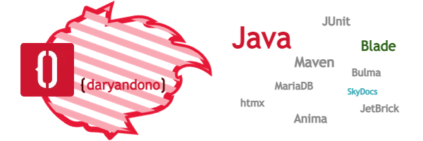

### **Perjalanan** menuju dunia antah berantah Java

Saya adalah penggemar Java serta rekayasa perangkat lunak, dan ini adalah tempat di mana saya akan berbagi perjalanan saya untuk belajar rekayasa perangkat lunak dan menjelajahi bahasa pemrograman Java beserta kerangka kerjanya. Semakin banyak saya belajar, semakin saya mengerti bahwa tidak ada satu cara pun untuk mencapai tujuan, terutama ketika terkait dengan teknologi, dan bagi saya... inilah jalan saya.

Selama pembelajaran, saya menemukan beberapa pengalaman menarik dan saya akan membagikannya sebagai sebuah set tutorial untuk Anda:
- Dasar pemrograman Java
- Pemrograman web dengan Java dan kerangka kerja [Blade]()
- Web template dengan [Jetbrick]()
- Operasi basis data dengan kerangka kerja [Anima]()
- Dasar operasi REST
- Operasi basic authentication dengan REST
- Operasi CRUD dengan REST
- dan lain sebagainya...
