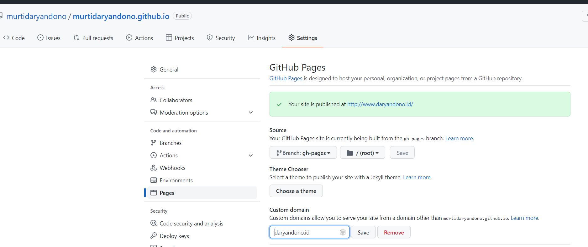

### Project : murtidaryandono.github.io

### Contents
1. Description
2. Tools
3. Run static site
4. Build static site
5. Publish static site

### 1. Description
**murtidaryandono.github.io** is a Java knowledge center site, build on top static site generator (SSG) technology with [SkyDocs](https://skydocs.skyost.eu/en/) as platform. Static site than hosted on Github pages and assigned with custom domain : www.daryandono.id.

### 2. Tools
Static site generator (SSG) : [SkyDocs](https://skydocs.skyost.eu/en/).

### 3. Run static site
```
java -jar SkyDocs-v0.7.4.jar serve
```

### 4. Build static site
```
java -jar SkyDocs-v0.7.4.jar build
```
Static site will be generated at "build" directory.

### 5. Publish static site
- **Option 1** : Publish as Github Pages
  - Push "build" directory as "gh-pages" branch for first time
```
git add build
git subtree push --prefix build origin gh-pages
```

  - Set domain for Github pages.


  - Push "build" directory as "gh-pages" branch for publishing
  ```
  git subtree push --prefix build origin gh-pages
  ```

- **Option 2** : Run static site on top java server (command refer to point 2).

source : [Publish Github pages](https://gist.github.com/cobyism/4730490)
